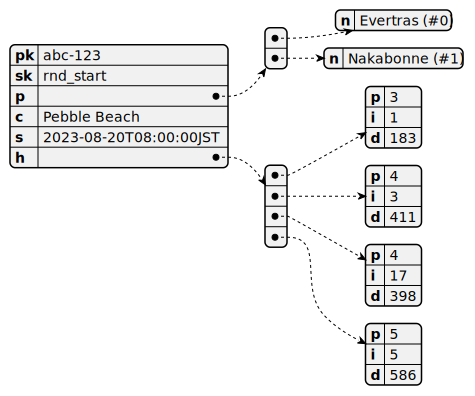
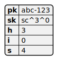

# Data

Taking the advice of [this AWS blog
post](https://aws.amazon.com/blogs/database/single-table-vs-multi-table-design-in-amazon-dynamodb/),
we try to use a single table overall and composite sort keys to help
differentiate different groups of hierarchical data.

## Round start events

Round start events consist of the following fields as their composite primary key:

- Round ID (Partition key)
- `rnd_start` (Sort key)

It also contains:

- Start time (date)
- Course (string)

| Field | Type   | Description                        |
| ----- | ------ | ---------------------------------- |
| `p`   | list   | The list of player names, in order |
| `c`   | string | The course name                    |
| `s`   | string | The start time                     |
| `h`   | list   | A list of hole data, in order      |

Player data includes:

| Field | Type   | Description |
| ----- | ------ | ----------- |
| `n`   | string | Player name |

Hole data includes:

| Field | Type   | Description                                     |
| ----- | ------ | ----------------------------------------------- |
| `p`   | number | Par                                             |
| `si`  | number | Stroke index of the hole                        |
| `d`   | number | Distance \*(TODO: different tees in the future) |

## Score events

Score events consist of the following fields as their composite primary key:

- Round ID (Partition key)
- `sc^[player_index]^[hole]` (Sort key)

It also contains:

| Field | Type   | Description                 |
| ----- | ------ | --------------------------- |
| `h`   | number | Hole number (usually 1-18)  |
| `i`   | number | Player index (0 indexed)    |
| `s`   | number | Player's score for the hole |

## Latest info

A special partition key that stores latest information.

- `latest` (Partition key)
- `rnd_id` (Sort key)

It also contains:

| Field | Type   | Description         |
| ----- | ------ | ------------------- |
| `id`  | string | The latest round ID |
