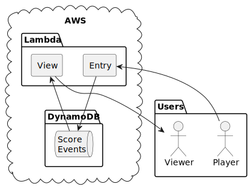

# Roadmap

## v0.1.0

- [ ] Create a round with a single unnamed player (UC1)
- [ ] Add a score to the round (UC2
- [ ] End the round (UC4)
- [ ] View the finished round (UC5)

Projected technical requirements:

- Create server application
- Create IaC for components listed below
  - Deploy endpoints so that they're accessible publicly
- Make viewer endpoint just reconstruct rounds from score data for now
- Add GHA for deployments, tests, etc.

